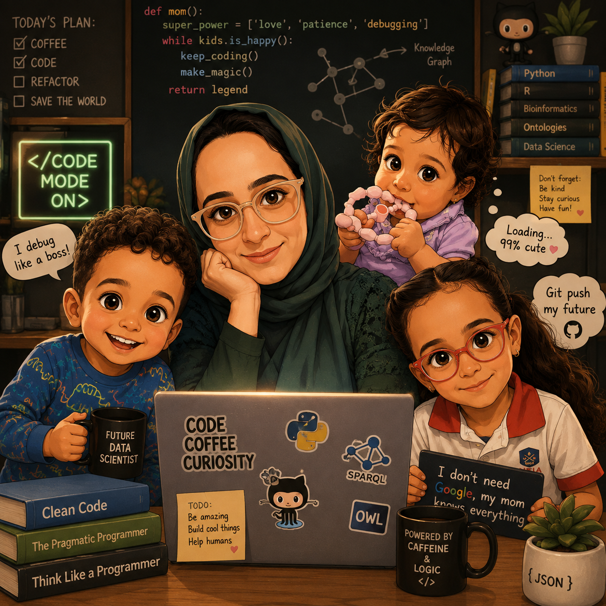

# 💙 Hi, I'm Dalia Alghamdi, PhD, Mommy

### 🧬 Bioinformatician · 🔷 Data Governance · 🧠 Biomedical Ontologies · 🔬 Clinical Research

---

## 🔷 About Me

I am a **bioinformatician and clinical research specialist** working at the intersection of **genomics, biomedical data, semantic technologies, and data governance**.

My work focuses on transforming complex biomedical and research data into **structured, interoperable, traceable, and reusable knowledge** — from genomic analysis and variant interpretation to biomedical ontologies, knowledge graphs, and research data management.

> 💙 **Turning data into knowledge — and knowledge into impact.**

---

## 🧬 What I Work On

<table>
<tr>
<td width="50%" valign="top">

### 🔬 Bioinformatics & Genomics

- NGS and genomic data analysis
- Variant interpretation & classification
- Biomedical database integration
- Genomic data standards

</td>
<td width="50%" valign="top">

### 🧠 Ontologies & Semantic Technologies

- Biomedical ontology engineering
- Knowledge graphs
- RDF · OWL · SPARQL
- Semantic data integration
- FAIR & Linked Data

</td>
</tr>

<tr>
<td width="50%" valign="top">

### 🔷 Data Governance & Management

- Research & healthcare data governance
- Metadata management
- Data quality & interoperability
- Data lineage & provenance
- Responsible data sharing

</td>
<td width="50%" valign="top">

### 🏥 Clinical & Translational Research

- Clinical research data management
- Research informatics
- Decision support systems
- Biomedical knowledge integration

</td>
</tr>
</table>

---

## 💻 Tech Stack

### Programming & Data

### Semantic Web & Knowledge Representation

### Data & Standards

---

## 🚀 Current Interests

🔹 Ontology-driven clinical decision support  
🔹 Genomic variant interpretation & evidence integration  
🔹 Biomedical knowledge graphs  
🔹 AI-ready biomedical data  
🔹 FAIR and interoperable research data  
🔹 Responsible health data sharing  

---

## 📚 Research

My research focuses on leveraging **ontologies and semantic technologies** to improve the representation, integration, retrieval, and traceability of biomedical knowledge.

A major focus of my work has been the development of the **Next Generation Biobanking Ontology (NGBO)**, extending semantic representation of biobanking information to include **omics-related contextual data**.

I am particularly interested in building solutions that bridge:

### 🧬 Bioinformatics × 🧠 Ontologies × 🔷 Data Governance

**for better biomedical knowledge, research, and decision support**

---

## 🤝 Let's Connect

I'm always interested in research and collaboration involving:

**Bioinformatics · Genomics · Biomedical Ontologies · Knowledge Graphs · Data Governance · Research Informatics · Semantic Web**

### 💙 Code · Curiosity · Knowledge · Impact

*Building useful things, learning continuously, and making biomedical data work better.*

